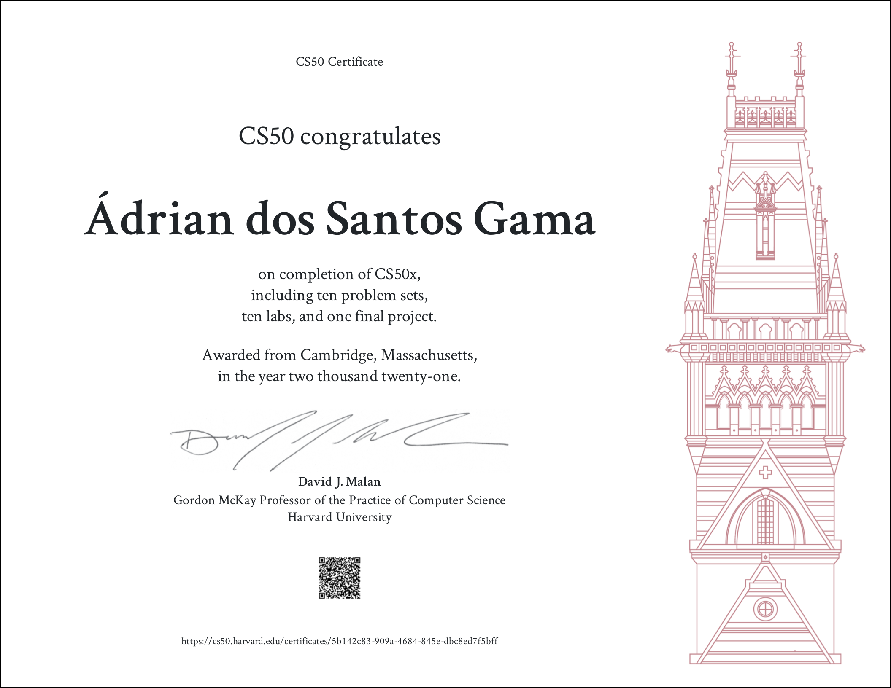

# CS50 Computer Science (2021)
Before read this repository files, remember the [Academic Honesty](https://cs50.harvard.edu/x/honesty/).
 
These files serve to give you a sense of how to do, iff, you feel lost in solving the problem.
 
Don't copy and paste any of these files, try to solve any problems by yourself.
#### Some of these codes are not a good reference, because I made them when I started studying computer science, but I hope they are useful.

## Table of contents
  * [Scratch](https://scratch.mit.edu/projects/376211200/)
  * Week 1
    * [Hello](./week1/hello/hello.c)
    * [Population](./week1/population/population.c)
    * Mario
      * [Less](./week1/mario/less/mario.c)
      * [More](./week1/mario/more/mario.c)
    * Greed
      * [Cash (Less)](./week1/greed/less/cash.c)
      * [Credit (More)](./week1/greed/more/credit.c)
  * Week 2
    * [Scrabble](./week2/scrabble/scrabble.c)
    * [Readability](./week2/readability/readability.c)
    * Encrypt
      * [Caesar (Less)](./week2/encrypt/less/caesar.c)
      * [Substitution (More)](./week2/encrypt/more/substitution.c)
  * Week 3
    * [Sort](./week3/sort/answers.txt)
    * [Plurality](./week3/plurality/plurality.c)
    * Election
      * [Runoff (Less)](./week3/election/less/runoff.c)
      * [Tideman (More)](./week3/election/more/tideman.c)
  * Week 4
    * [Volume](./week4/volume/volume.c)
    * Filter
      * [Less](./week4/filter/less/helpers.c)
      * [More](./week4/filter/more/helpers.c)
    * [Recover](./week4/recover/recover.c)
  * Week 5
    * [Inheritance](./week5/inheritance/inheritance.c)
    * [Speller](./week5/speller/dictionary.c)
  * Week 6
    * [World Cup](./week6/tournament/tournament.py)
    * [Hello](./week6/hello/hello.py)
    * Mario
      * [Less](./week6/mario/less/mario.py)
      * [More](./week6/mario/more/mario.py)
    * Greed
      * [Cash (Less)](./week6/greed/less/cash.py)
      * [Credit (More)](./week6/greed/more/credit.py)
    * [Readability](./week6/readability/readability.py)
    * [DNA](./week6/dna/dna.py)
  * Week 7
    * [Songs](./week7/songs/answers.sql)
    * [Movies](./week7/movies/answers.sql)
    * [Fiftyville](./week7/fiftyville/log.sql)
  * Week 8
    * [Trivia](./week8/trivia)
    * [Homepage](./week8/homepage)
  * Week 9
    * [Birthdays](./week9/birthdays)
    * [Finance](./week9/finance)
  * [Final Project](https://gitlab.com/potential-garbage/cs50/image-spell)

## Cetificate

